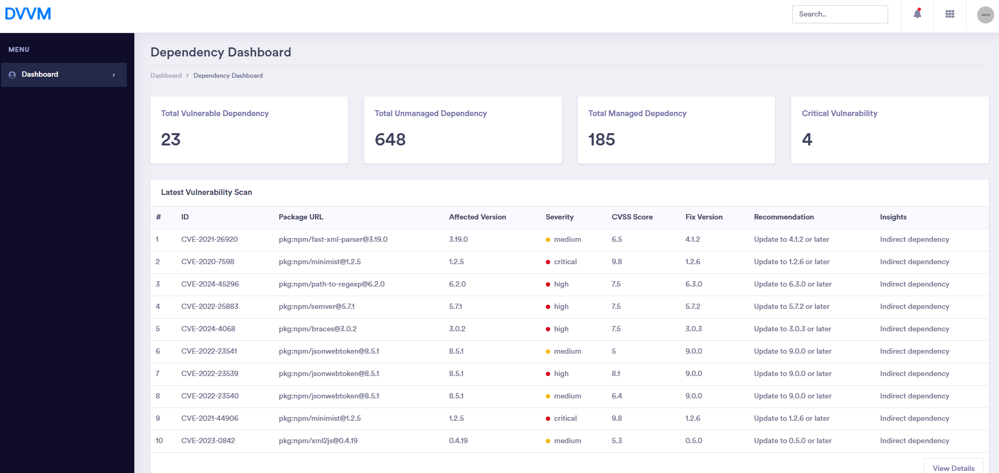
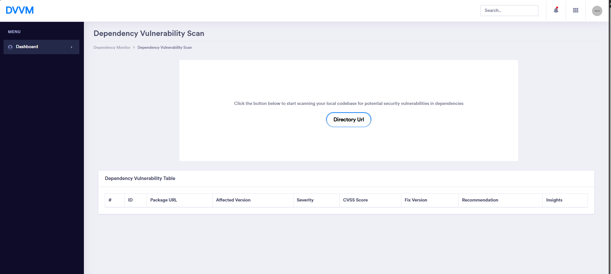

# Dependency Management System

**Dashboard template:** https://colorlib.com/polygon/concept/index.html

# Preview

### Screenshot

### TOC
- [Built With](#built-with)
- [Changelog](#changelog)
- [Authors](#authors)
- [License](#license)

### Built With

- Peity Charts
- Sparklines
- Scrollbar
- TouchSpin
- Data Table
- JsTree
- Skycons
- Password Meter
- PDF Viewer
- Mapael
- jvectormap
- RangeSlider
- Cropper
- Data Map
- CodeMirror
- Chosen
- C3 And D3
- datetimepicker
- x-editable
- dropzonejs
- form Validation
- masked input
- mockjax
- lobibox
- summernote
- editable

### Changelog
#### V 1.0.0
Initial Release
### Authors
[Colorlib](https://colorlib.com)
[Thang Huu Huynh](https://github.com/HuynhHuuThang)

### More info
- [Bootstrap dashboards](https://colorlib.com/wp/free-bootstrap-admin-dashboard-templates/)
- [Free Admin Templates](https://colorlib.com/wp/free-admin-templates/)
- [Free HTML templates](https://colorlib.com/wp/free-html-website-templates/)
- [Bootstrap Templates](https://colorlib.com/wp/templates/)
- [Free WordPress Themes](https://colorlib.com/wp/free-wordpress-themes/)

### License

Concept is licensed under The MIT License (MIT). Which means that you can use, copy, modify, merge, publish, distribute, sublicense, and/or sell copies of the final products. But you always need to state that Colorlib is the original author of this template.

#### WorkFlow
Write Data to DB from JSON file - done
trigger the BE API 
Get Data from DB
Print DB to Webpage
Pass parameter through front end 

